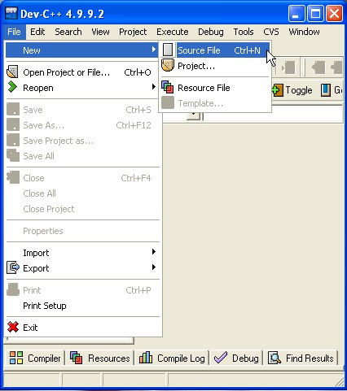

<link href="css/style.css" rel="stylesheet">

# Learn C Programming 
## with Meraj Kazi

A simple book to learn basics of C programming language easily. It'll help beginners to learn programming easily ^__^ 

   

## History in brief 
C language was originally developed by _Dennis Ritchie_ between 1969 and 1973 at Bell Labs. One of the most used programming language till today and still being used in numerous sectors of computer science.

## Before we start:
We need a compiler software installed in our PC in which we'll write, compile and run our codes in C. 
Here's is a list of some C language compilers:

- [Codeblocks](http://www.codeblocks.org/downloads/26)
- [Dev C++](https://sourceforge.net/projects/orwelldevcpp/) 
- [Vim](http://www.vim.org/download.php) (_my favourite, but don't try if you're a biginner_) 
- Turbo C etc.

Codeblocks or Dev C++ will be better choice for beginners. So, download any one of those and install it in your PC. After installing successfully, open it. Go to the top left and click on the tab named `File` and select `new file` or `new source file` or just `new` and then `source file`. 

Then you'll get a blank file opened in front of you. First, you need to save it as C file format because right now it is just a text file with no format. To make it a C file you need to save it in C format. To save it in C format, click on that top left `File` again and click on `save as` and then a new window will come.    
Look at the downside of that new window. You'll see the filename and format. Delete all and name it **_test.c_**. Here `.c` is the format and **_test_** is the name. You can give it another name but format must be `.c`.    
And there should be **_no blank space_** in name. Suppose, file names like `my first program` is not valid. It should be like `my-first-program.c` or `MyFirstProgram.c`. Whatever you put as name, there shoud be `.c` after the name because that defines the format of C language. 

## Start Coding in C

